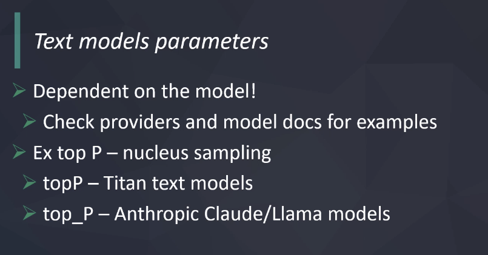
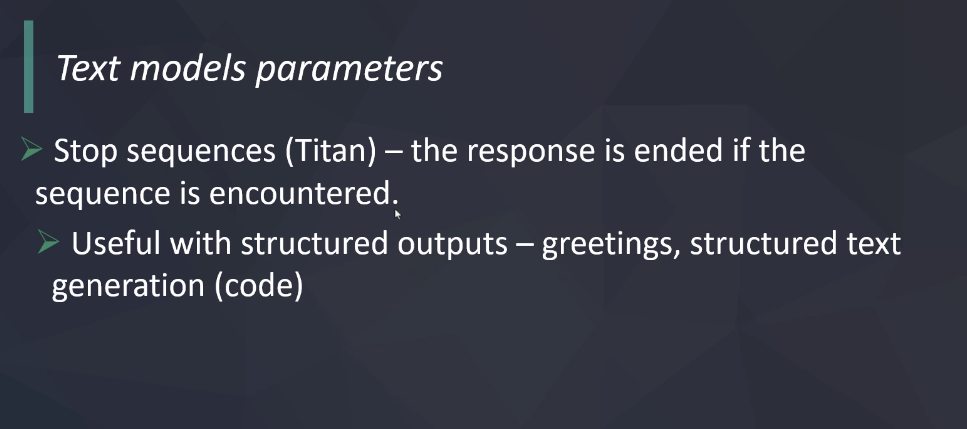
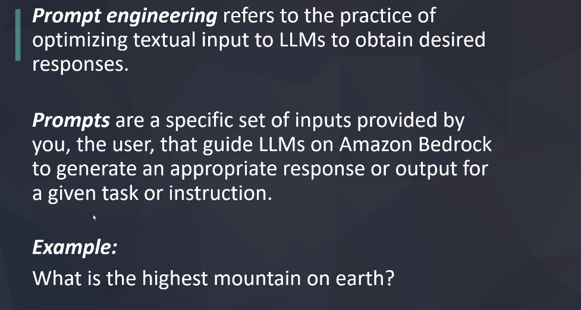
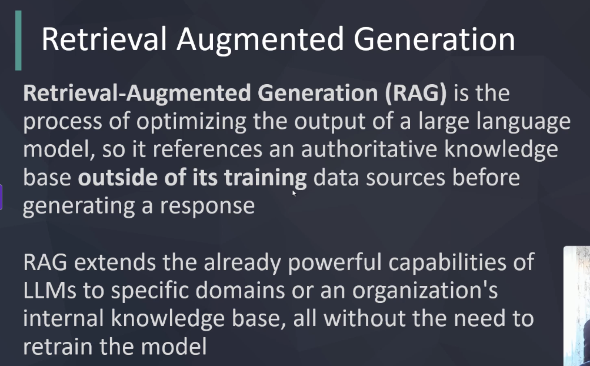
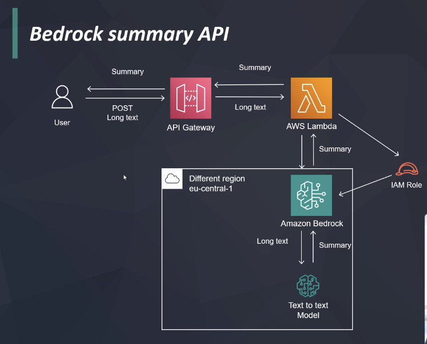

# AWS Bedrock - The Complete Guide to AWS Generative AI
Udemy course at [The Complete Guide to AWS Generative AI](https://www.udemy.com/course/amazon-bedrock-aws-generative-ai)

## npm setup
```bash
npm init

npm install -D typescript ts-node @types/node

npm i @aws-sdk/client-bedrock @aws-sdk/client-bedrock-runtime @aws-sdk/client-bedrock-agent
```

## 3.1 Understanding Tokens

### Bedrock Pricing
[Bedrock Pricing](https://aws.amazon.com/bedrock/pricing/)

### Openai tokenizer
[Openai Tokenizer](https://platform.openai.com/tokenizer)

## 3.2 Text Model Parameters


### Nucleus Sampling
Nucleus sampling (often called “top‑p sampling”) is a technique used during text generation to control the randomness and diversity of the output. In AWS Bedrock text models, the parameter "Ex top P" (which essentially corresponds to the "top_p" setting) works as follows:

- **How It Works:**  
  Instead of considering the entire vocabulary when selecting the next token, the model sorts all potential tokens by their probability and then selects only from the smallest set of tokens whose cumulative probability meets or exceeds the threshold specified by top_p. For example, if top_p is set to 0.9, the model will sample the next word only from the tokens that together account for 90% of the probability mass.

- **Effect on Generation:**  
  - A **lower top_p value** (e.g. 0.7) makes the output more deterministic and focused because only the highest-probability tokens are considered.  
  - A **higher top_p value** (e.g. 0.95) introduces more diversity and creativity into the generated text because a larger pool of tokens is available for sampling.

- **Why It's Useful:**  
  This method strikes a balance between determinism and randomness. It avoids the pitfalls of always selecting the single most likely token (which can be too repetitive) while also not considering extremely unlikely tokens that might degrade the quality of the output.

In summary, the "Ex top P" parameter in Bedrock text models determines the cumulative probability threshold for nucleus sampling, thereby influencing the diversity and creativity of the generated text.

### Stop Sequences


### Prompt Engineering


### RAG
RAG (Retrieval-Augmented Generation) is a technique that combines the strengths of retrieval-based methods and generative models to produce more accurate and contextually relevant responses. In the context of AWS Bedrock, RAG can be implemented by integrating external knowledge sources or databases with the generative capabilities of the text models.


## Section 8 Text API



### IaC with CDK
1. Initialize a new CDK project:
   ```bash
   cdk init app --language=python
   ```
#### Useful commands

 * `cdk ls`          list all stacks in the app
 * `cdk synth`       emits the synthesized CloudFormation template
 * `cdk deploy`      deploy this stack to your default AWS account/region
 * `cdk diff`        compare deployed stack with current state
 * `cdk docs`        open CDK documentation   
